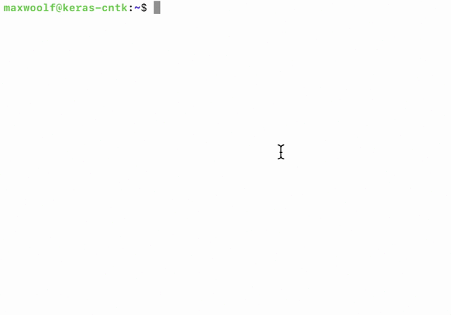

# keras-cntk-docker



Docker container for keras + cntk intended for nvidia-docker. Based off of 
Durgesh Mankekar's minimal [keras/jupyter container](https://github.com/durgeshm/dockerfiles/tree/master/jupyter-keras-gpu) + corresponding [blog post](https://medium.com/google-cloud/containerized-jupyter-notebooks-on-gpu-on-google-cloud-8e86ef7f31e9).

This container contains CNTK, TensorFlow, and Keras. When Keras is run in the container, CNTK will be the selected backend by default. Only recommended to run on a GPU instance.

[Container on Docker Hub](https://hub.docker.com/r/minimaxir/keras-cntk/)

## Usage

To set up the CUDA+container drivers from scratch on the GPU instance, run these commands:

```sh
curl -O -s https://raw.githubusercontent.com/minimaxir/keras-cntk-docker/master/deps_nvidia_docker.sh
sudo sh deps_nvidia_docker.sh
```
You may need to run the script again after a few days (due to a GPU update on host hardware)

To run a deep learning script in the container:
```sh
sudo docker run --runtime=nvidia run -it --rm -v $(pwd)/:/keras --name keras minimaxir/keras-cntk python3 <x>.py
```

Where `<x>` is the Python script on the host server.

To run TensorFlow on Keras in the container instead of CNTK, add a `-e KERAS_BACKEND='tensorflow'` flag:

```sh
sudo docker run --runtime=nvidia run -it --rm -v $(pwd)/:/keras --name keras -e KERAS_BACKEND='tensorflow' minimaxir/keras-cntk python3 <x>.py
```

To run a Jupyter Notebook in the container (where invoking Keras in a notebook will use the CNTK backend):

```sh
sudo docker run --runtime=nvidia -it --rm -p 8888:8888 -v $(pwd):/keras --name jupyter minimaxir/keras-cntk jupyter notebook --allow-root
```

## Run TensorBoard and Jupyter

Running both TensorBoard and Jupyter in the same container requires starting up TensorBoard in the background, then running Jupyter in the foreground:

```sh
sudo docker run --runtime=nvidia -d --rm -p 8888:8888 -p 6006:6006 -v $(pwd):/keras --name jupyter -e KERAS_BACKEND='tensorflow' minimaxir/keras-cntk tensorboard --logdir=/keras/logs
sudo docker exec -it jupyter bash
jupyter notebook --allow-root
```

TensorBoard will be available on Port 6006; you'll need to use the [TensorBoard callback](https://keras.io/callbacks/#tensorboard) in Keras to make results visible in TensorBoard.

Note that with this approach, killing the Jupyter console will not kill the container; you have to `exit` bash and run `sudo docker kill jupyter`.

## Error Note

If you get a `docker: Error response from daemon: OCI runtime create failed:` error when creating the container, try reinstalling the GPU drivers on the host:

```sh
curl -O -s http://us.download.nvidia.com/XFree86/Linux-x86_64/384.111/NVIDIA-Linux-x86_64-384.111.run
sudo sh ./NVIDIA-Linux-x86_64-384.111.run -a --ui=none --no-x-check && rm NVIDIA-Linux-x86_64-384.111.run
```

## Maintainer

Max Woolf ([@minimaxir](http://minimaxir.com))

*Max's open-source projects are supported by his [Patreon](https://www.patreon.com/minimaxir). If you found this project helpful, any monetary contributions to the Patreon are appreciated and will be put to good creative use.*

## Credits

Install script `deps_nvidia_docker.sh` sourced from Durgesh Mankekar's blog post noted above. (reproduced here for postertity)